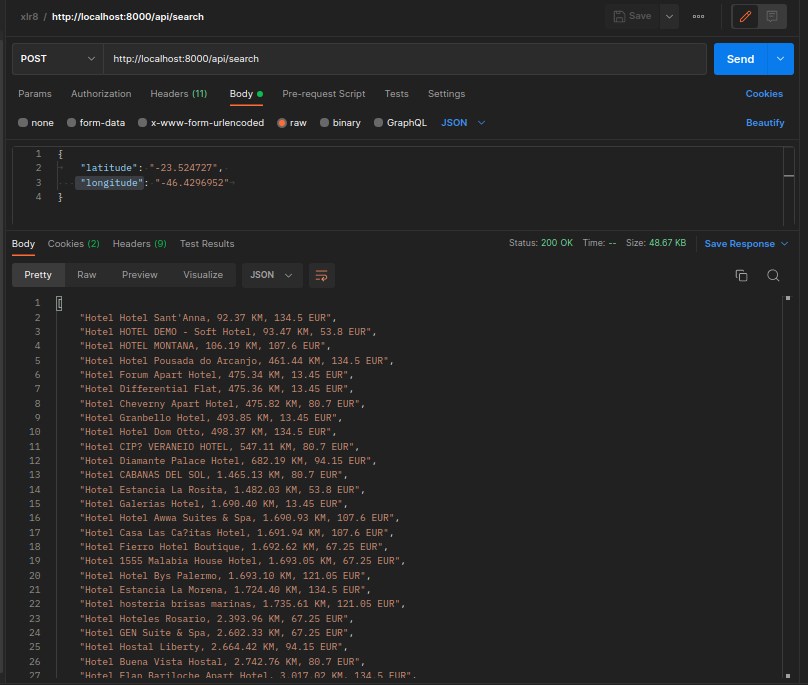

# Entrevista de back-end XLR8 - XLR8 Backend Interview

<p align="center"></p>

<p align="center">
<a href="https://travis-ci.org/laravel/framework"></a>
<a href="https://packagist.org/packages/laravel/framework"></a>
<a href="https://packagist.org/packages/laravel/framework"></a>
<a href="https://packagist.org/packages/laravel/framework"></a>
</p>

## About XLR8 - Entrevista de back-end XLR8

## Historia

John decidiu passar o fim de semana fora com a família, e para isso precisa encontrar um hotel próximo ao local
escolhido. Para João existem 2 fatores importantes para a escolha certa do hotel - localização e preço, portanto, ele
precisa pesquisar locais próximos a um local específico, identificado por Latitude e Longitude e obter a lista de
resultados ordenados por proximidade do local ou por preço por noite .

Seu trabalho é desenvolver uma maneira de dar a John a oportunidade de encontrar o lugar certo para sua
tão desejada escapada com sua família.

Pesquisar::getNearbyHotéis( $latitude, $longitude, $orderby)

Seu código deve estar preparado para processar múltiplas fontes de dados (número dinâmico), ou seja,
múltiplos endpoints:

- [Fonte 1](https://xlr8-interview-files.s3.eu-west-2.amazonaws.com/source_1.json).
- [Fonte 2](https://xlr8-interview-files.s3.eu-west-2.amazonaws.com/source_2.json).

## Saida

## Expected output

Output should be a list of results with the following format:

● Hotel Name, Distance to local in KM, Price Per night

Sample output

● Hotel Lisbon, 1.7 KM, 23.56 EUR
● Hotel London, 8 KM, 11.56 EUR
● Hotel XPTO, 21.56 KM, 99.56 EUR

## Usei postman para retornar os dados em JSON

<p align="center"></p>


- Import to Postman => xlr8.postman_collection.json

OR

- URL POST: http://localhost:8000/api/search

```json
{
	"latitude": "-23.524727", 
    "longitude": "-46.4296952"	
}
```

## Dados que utilizei para testes.
```
- "latitude": "38.7071", 
- "longitude": "-9.13549"	

- "latitude": "-23.524727", 
- "longitude": "-46.4296952"	
```

- Renato Lucena 2022
